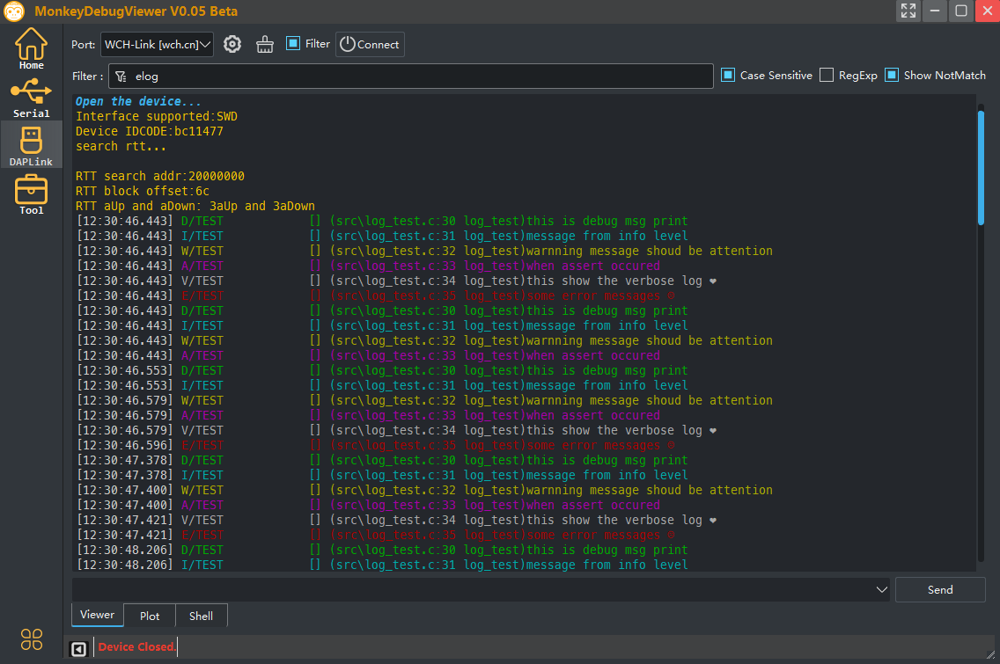
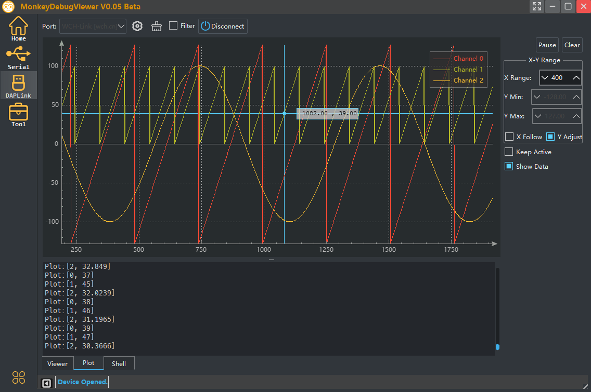
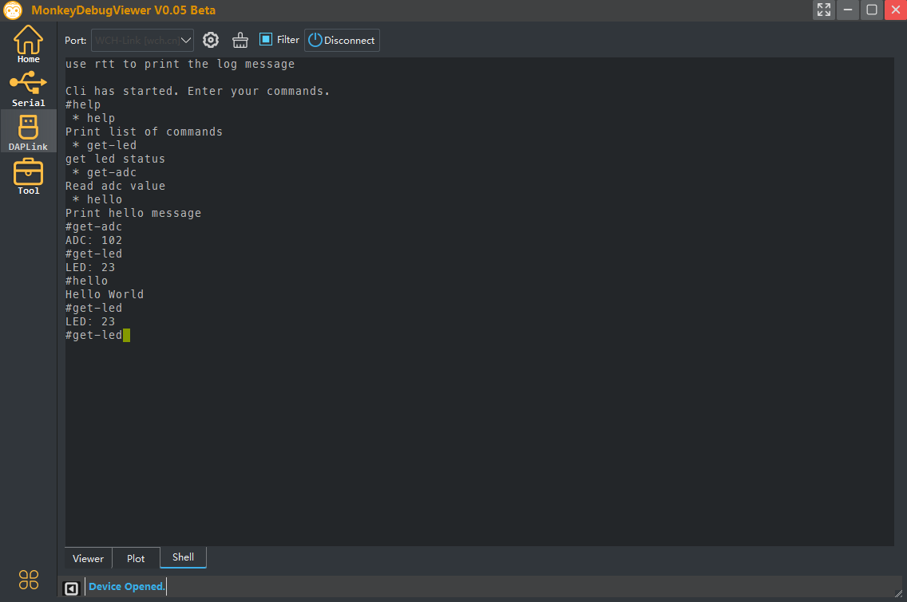
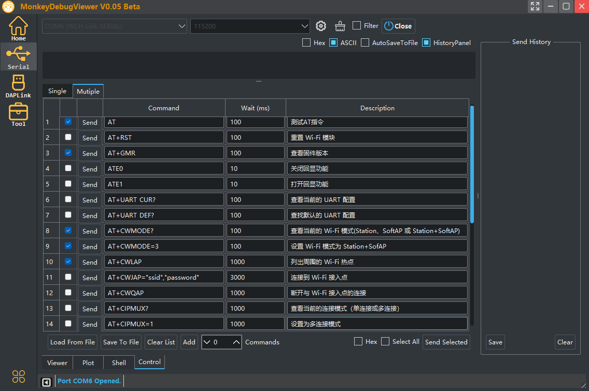
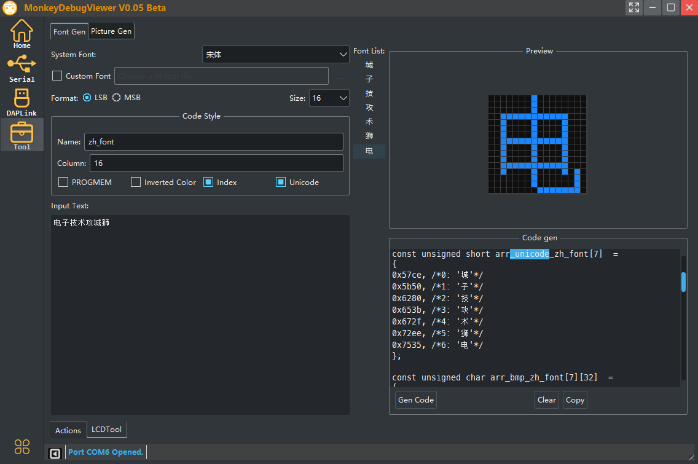

# MonkeyDebugViewer

#### A debug tool for embedded development.

- document: [https://makerinchina.cn/wiki/](https://makerinchina.cn/wiki/)

- screenshot of log viewer with Serial or DAPLink :
   
   
- screenshot of plot viewer with Serial or DAPLink :
  
   
   
- screenshot of shell viewer with Uart or DAPLink :

  

- screenshot of serial Contrl view:

  

- screenshot of Tool View:

     

   

- **More Info on my website:** [https://makerinchina.cn](https://makerinchina.cn)

> This is the beta version.

- TODO:
  - modbus view
  - some useful tools for MCU development
  - ...

##### Release Notes

- V0.05 Beta

|             | Suport                                                      | Test                                     |
| ----------- | ----------------------------------------------------------- | ---------------------------------------- |
| Serial View | add Serial Control view                                     | ESP8266 AT cmd List                      |
| Tool View   | add Actions Running tool; add LCD font and picture gen tool | Flash tool Action; u8g2 lib picture show |

- V0.04 Beta

|              | Support               | Test |
| ------------ | --------------------- | ---- |
| DapLink View | add shell view(vt100) | -    |
| Serial View  | add shell view(vt100) | -    |

- V0.03 Beta

|         | Support                                                      | Test |
| ------- | ------------------------------------------------------------ | ---- |
| DapLink | Support CMSIS DAP V2 winusb Device ( HID version now removed) | -    |

- V0.02 Beta

|              | Support        | Test |
| ------------ | -------------- | ---- |
| DapLink View | Plot view      | -    |
| Serial View  | Plot view      | -    |
| App          | Window Display | -    |

- V0.01 Beta

|              | Support                     | Test              |
| ------------ | --------------------------- | ----------------- |
| DapLink View | USB HID Device/CMSIS DAP V1 | CMSIS DAP Device  |
| Serial View  | ANSI Color print            | CH340 USB to UART |

