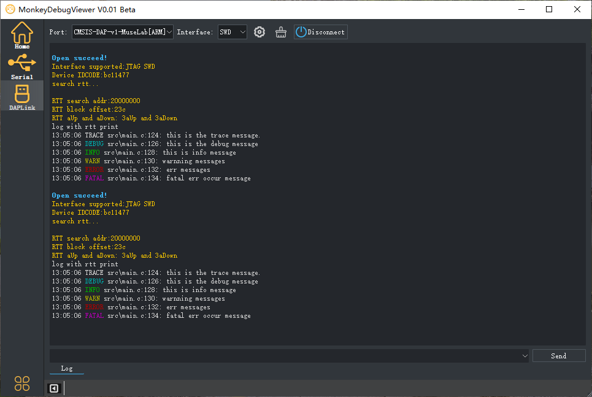
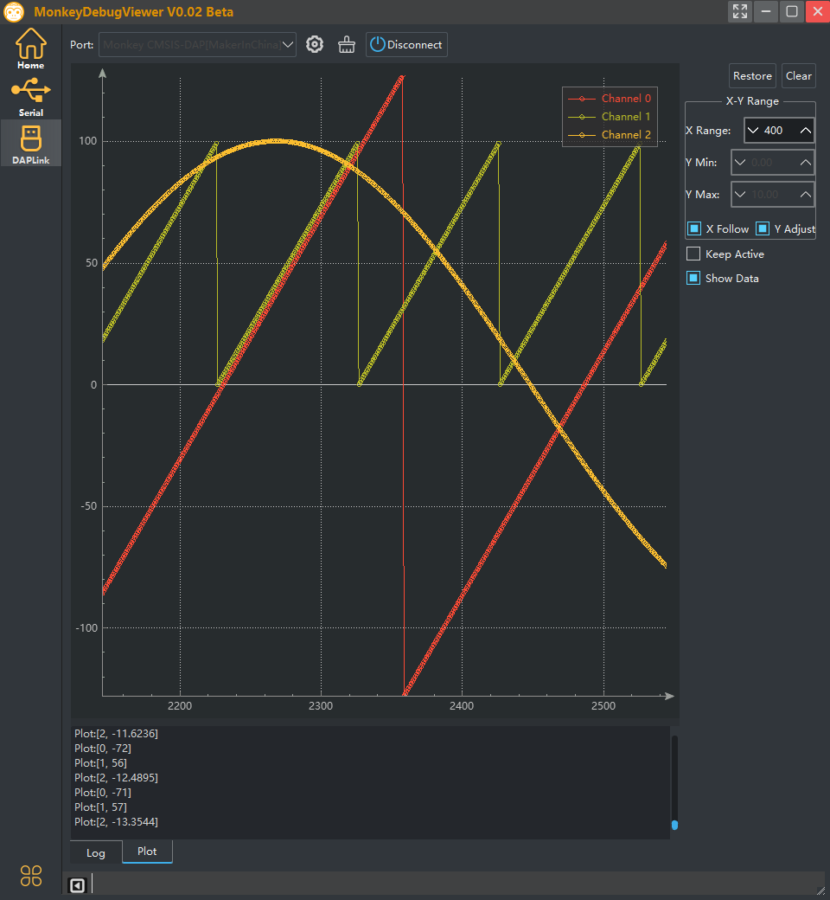
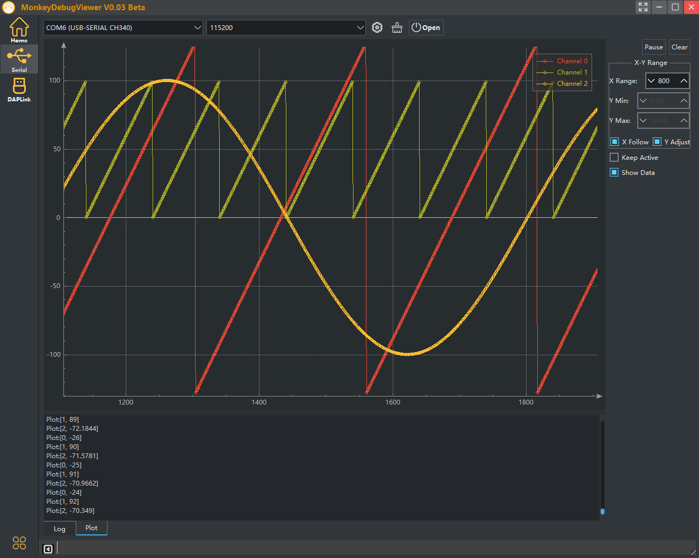

# MonkeyDebugViewer

#### A debug tool for embedded development.

- document: [https://makerinchina.cn/wiki/](https://makerinchina.cn/wiki/)

- screenshot of rtt log viewer:(use cmsis-dap V2 and SEGGER RTT print color log library)
   
- screenshot of serial log viewer:(CH340 usb)
   

- screenshot of dap plot viewer:(v0.02 update)

  

- screenshot of serial plot viewer:(v0.02 update)

  

- **More Info on my website:** [https://makerinchina.cn](https://makerinchina.cn)

> This is the beta version.

- TODO:
  - log level filter
  - modbus view
  - ...

##### Release Notes

- V0.03 Beta

|         | Support                                                      | Test |
| ------- | ------------------------------------------------------------ | ---- |
| DapLink | Support CMSIS DAP V2 winusb Device ( HID version now removed) | -    |

- V0.02 Beta

|              | Support        | Test |
| ------------ | -------------- | ---- |
| DapLink View | Plot view      | -    |
| Serial View  | Plot view      | -    |
| App          | Window Display | -    |

- V0.01 Beta

|              | Support                     | Test              |
| ------------ | --------------------------- | ----------------- |
| DapLink View | USB HID Device/CMSIS DAP V1 | CMSIS DAP Device  |
| Serial View  | ANSI Color print            | CH340 USB to UART |

